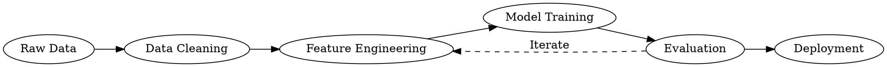

## Utility Tools for Data Scientists

While programming languages, libraries, and frameworks form the core of your data science toolkit, a collection of utility tools can significantly enhance your productivity and effectiveness. This chapter covers specialised tools that address specific needs in the data science workflow.

### AI Coding Assistants

Large-language-model-based coding assistants are probably the single biggest productivity change in data science tooling since this book was first drafted. For readers without a CS background they're especially useful: they can scaffold boilerplate, explain unfamiliar code, translate between Python and R, suggest fixes for cryptic error messages, and draft regex patterns or SQL queries on request. The caveat is universal: they confidently produce wrong answers too, so treat suggestions as a fast draft to be reviewed, not an oracle.

A few options worth knowing, all with free tiers for individuals:

- **[GitHub Copilot](https://github.com/features/copilot)**: In-editor completion and chat inside VS Code, JetBrains IDEs, Neovim, and the web. The most mature and widely used option; free for verified students, educators, and maintainers of popular open-source projects.
- **[Claude for VS Code](https://docs.claude.com/en/docs/claude-code/ide-integrations) and [Claude Code](https://www.claude.com/product/claude-code)**: Anthropic's CLI and IDE integrations. Claude Code runs in a terminal and can read, edit, and run code in a project with your supervision. Particularly good for multi-file refactors.
- **[Cursor](https://cursor.com/)**: A fork of VS Code with deep LLM integration throughout the editor. Popular with developers who want a single tool rather than an extension.
- **[Aider](https://aider.chat/)**: An open-source terminal-based pair-programmer that uses git commits as its unit of work. A great fit if you already live in the terminal.

For genuinely throwaway tasks, the web chat interfaces to [Claude](https://claude.ai/) and [ChatGPT](https://chat.openai.com/) are fine. For anything you'll actually check into a repository, prefer an IDE integration so the suggestions have full context of your code.

A few habits that make these tools more useful and less dangerous:

1. **Read the diff**. Never accept an edit without skimming what changed.
2. **Don't paste secrets**. Anything you put into a prompt may end up in provider logs. Strip API keys, connection strings, and personal data before sharing code.
3. **Ask for explanations alongside code**. "Write this function and explain why you chose this approach" is a much better prompt than "write this function", because you learn something and can spot mistakes faster.
4. **Run the code**. LLMs hallucinate function signatures, flag names, and library behaviours. Trust the interpreter over the chatbot.

### Text Editors and IDE Enhancements

The intro chapter covers **Visual Studio Code** (VS Code) as the primary recommended editor for data science across Python, R, SQL, and notebooks. It's free, cross-platform, scriptable, and has the largest extension ecosystem of any editor. For most readers, VS Code plus the extensions listed in the intro chapter will cover 90% of your needs.

The editors below are lightweight alternatives for quick edits, very large files, or platform-specific situations.

#### Notepad++

Notepad++ is a free, open-source text editor for Windows that's more powerful than the default Notepad application.

**Key features for data scientists:**

1. **Syntax highlighting**: Supports many languages including Python, R, SQL, JSON, and more
2. **Column editing**: Edit multiple lines simultaneously (useful for cleaning data)
3. **Regex search and replace**: Powerful pattern matching for text manipulation
4. **Macro recording**: Automate repetitive text edits
5. **Plugins**: Extend functionality with viewers for JSON, HTML, Markdown, and other common data-science file formats.

**Installation:**

1. Download from [notepad-plus-plus.org](https://notepad-plus-plus.org/downloads/)
2. Run the installer and follow the prompts

**Useful shortcuts:**

- `Ctrl+H`: Find and replace
- `Alt+Shift+Arrow`: Column selection mode
- `Ctrl+D`: Duplicate current line
- `Ctrl+Shift+Up/Down`: Move current line up/down

Notepad++ is particularly useful for quickly viewing and editing large text files, CSV data, or configuration files without launching a full IDE. Its ability to handle multi-gigabyte files makes it valuable for inspecting large datasets.

Notepad++ (as of writing) is not available on Mac, but the following alternative is.

#### Sublime Text

Sublime Text is a sophisticated cross-platform text editor with powerful features for code editing.

**Key features for data scientists:**

1. **Multiple selections**: Edit many places at once
2. **Command palette**: Quickly access commands without menus
3. **Distraction-free mode**: Focus on your text without UI elements
4. **Splits and grids**: View multiple files or parts of files simultaneously
5. **Customizable key bindings**: Create shortcuts tailored to your workflow

**Installation:**

1. Download from [sublimetext.com](https://www.sublimetext.com/download)
2. Install and activate (free evaluation with occasional purchase reminder)

Sublime Text's speed and versatility make it excellent for manipulating text data, writing scripts, or making quick edits to code without launching a heavier IDE.

### API Development and Testing Tools

APIs (Application Programming Interfaces) are crucial for accessing web services and databases. These tools help you test, debug, and document APIs.

#### Postman

Postman is the industry standard for API development and testing.

**Key features for data scientists:**

1. **Request building**: Create and save HTTP requests
2. **Collections**: Organise and share API requests
3. **Environment variables**: Manage different settings (dev/prod)
4. **Automated testing**: Create test scripts to validate responses
5. **Mock servers**: Simulate API responses without a backend

**Installation:**

1. Download from [postman.com](https://www.postman.com/downloads/)
2. Create a free account to sync across devices

**Example workflow:**

1. Create a new request to a data API:

   ```
   GET https://api.example.com/data?limit=100
   ```

2. Add authentication (if required):

   ```
   Authorization: Bearer your_token_here
   ```

3. Send the request and analyse the JSON response
4. Save the request to a collection for future use

Postman is invaluable when working with data APIs, whether you're fetching data from public sources like financial markets, weather services, or social media platforms, or interacting with internal company APIs.

#### Insomnia

Insomnia is a lightweight alternative to Postman with an intuitive interface.

**Key features:**

1. **Clean, focused UI**: Less complex than Postman
2. **GraphQL support**: Built-in tools for GraphQL queries
3. **Request chaining**: Use data from one request in another
4. **Environment management**: Switch between configurations easily
5. **Open source**: Free core version available

**Installation:**

1. Download from [insomnia.rest](https://insomnia.rest/download)
2. Run the installer

For data scientists who occasionally work with APIs but don't need Postman's full feature set, Insomnia offers a streamlined alternative.

### Database Management Tools

These tools provide graphical interfaces for working with databases, making it easier to explore and manipulate data.

#### DBeaver

DBeaver is a universal database tool that works with almost any database system.

**Key features for data scientists:**

1. **Multi-database support**: Works with PostgreSQL, MySQL, SQLite, Oracle, and more
2. **Visual query builder**: Create SQL queries without writing code
3. **Data export/import**: Move data between different formats and databases
4. **ER diagrams**: Visualise database structure
5. **SQL editor**: Write and execute queries with syntax highlighting

**Installation:**

1. Download from [dbeaver.io](https://dbeaver.io/download/)
2. Run the installer

**Example workflow:**

1. Connect to a database with connection parameters
2. Browse tables and view structure
3. Use the SQL editor to write a query:

   ```sql
   SELECT 
       product_category,
       COUNT(*) as count,
       AVG(price) as avg_price
   FROM products
   GROUP BY product_category
   ORDER BY count DESC;
   ```

4. Export results to CSV for analysis in Python or R

DBeaver streamlines database interactions, allowing you to explore data structures, write queries, and export results without writing code to establish database connections.

#### pgAdmin

pgAdmin is a specialised tool for PostgreSQL databases.

**Key features:**

1. **PostgreSQL-specific features**: Optimised for PostgreSQL
2. **Server monitoring**: View database performance
3. **Backup and restore**: Manage database backups
4. **User management**: Control access to databases
5. **Procedural language debugging**: Test stored procedures

**Installation:**

1. Download from [pgadmin.org](https://www.pgadmin.org/download/)
2. Run the installer

For data scientists working specifically with PostgreSQL databases, pgAdmin provides specialised features that generic tools may lack.

### File Comparison and Merging Tools

These tools help identify differences between files and directories, which is useful for comparing datasets or code versions.

#### Beyond Compare

Beyond Compare is a powerful file and directory comparison tool.

**Key features for data scientists:**

1. **Text comparison**: View differences between text files line by line
2. **Table comparison**: Compare CSV and Excel files with data-aware features
3. **Directory sync**: Compare and synchronise folders
4. **3-way merge**: Resolve conflicts between different versions
5. **Byte-level comparison**: Analyse binary files

**Installation:**

1. Download from [scootersoftware.com](https://www.scootersoftware.com/download.php)
2. Install (trial version available)

**Example data science use case:**
Comparing two versions of a dataset to identify changes:

1. Open two CSV files in Table Compare mode
2. Automatically align columns by name
3. Identify added, removed, or modified rows
4. Export the differences to a new file

Beyond Compare is particularly valuable when dealing with evolving datasets, where you need to understand what changed between versions.

#### WinMerge

WinMerge is a free, open-source alternative for file and folder comparison.

**Key features:**

1. **Visual text comparison**: Side-by-side differences with highlighting
2. **Folder comparison**: Compare directory structures
3. **Image comparison**: Visual diff for images
4. **Plugins**: Extend functionality for additional file types
5. **Integration**: Works with source control systems

**Installation:**

1. Download from [winmerge.org](https://winmerge.org/downloads/)
2. Run the installer

WinMerge is an excellent free option for basic comparison needs, though it lacks some of the advanced features of commercial alternatives.

### Terminal Enhancements

Improving your command line experience can significantly boost productivity when working with data and code.

#### Oh My Zsh

Oh My Zsh is a framework for managing your Zsh configuration, providing themes and plugins for the Z shell.

**Key features for data scientists:**

1. **Tab completion**: Intelligent completion for commands and paths
2. **Git integration**: Visual indicators of repository status
3. **Syntax highlighting**: Colour-coded command syntax
4. **Command history**: Improved search through previous commands
5. **Customizable themes**: Visual enhancements for the terminal

**Installation (macOS or Linux):**

```bash
# Install Zsh first if needed
# Ubuntu/Debian:
# sudo apt install zsh
# macOS (usually pre-installed)

# Set Zsh as default shell
chsh -s $(which zsh)

# Install Oh My Zsh. It's good practice to review the installer script
# before executing anything you download from the internet:
curl -fsSL https://raw.githubusercontent.com/ohmyzsh/ohmyzsh/master/tools/install.sh -o install-ohmyzsh.sh
less install-ohmyzsh.sh   # read it, check for anything suspicious
sh install-ohmyzsh.sh
```

Many sites still show a one-liner `sh -c "$(curl ... install.sh)"`, which downloads and immediately executes code from a third-party server. The two-step version above takes five extra seconds and lets you actually see what's about to run on your machine.

**Useful plugins for data scientists:**

```bash
# Edit ~/.zshrc to activate plugins
plugins=(git python pip conda docker jupyter)
```

Oh My Zsh makes the command line more user-friendly and efficient, which is valuable when working with data processing tools, running scripts, or managing environments.

#### Windows Terminal and PowerShell 7

On Windows, **Windows Terminal** (pre-installed on Windows 11 and free from the Microsoft Store on Windows 10) is a huge upgrade over the legacy `cmd.exe` and the old PowerShell window: tabs, split panes, GPU-accelerated rendering, and sensible keyboard shortcuts. Pair it with **PowerShell 7** (`winget install Microsoft.PowerShell`), which is cross-platform and much more pleasant to script than the built-in Windows PowerShell 5.1. If you want a Unix-like experience on Windows, use WSL (covered in the intro chapter) from inside Windows Terminal, which handles both worlds side-by-side.

#### Modern Rust-based CLI replacements

A family of newer command-line tools, mostly written in Rust, have become the de-facto replacements for the standard Unix utilities. They're all faster than the originals and, more importantly for this book's audience, tend to have friendlier defaults and output. Every one is installable with Homebrew, apt, `winget`, `choco`, or `cargo`:

| Instead of | Use | What you get |
|---|---|---|
| `grep` | **[ripgrep](https://github.com/BurntSushi/ripgrep)** (`rg`) | Much faster recursive search; respects `.gitignore` by default |
| `find` | **[fd](https://github.com/sharkdp/fd)** | Saner syntax, colour output, ignores VCS noise |
| `cat` | **[bat](https://github.com/sharkdp/bat)** | Syntax highlighting and line numbers |
| `ls` | **[eza](https://github.com/eza-community/eza)** | Git status, icons, tree view |
| `cd` | **[zoxide](https://github.com/ajeetdsouza/zoxide)** | `z projectname` jumps to any directory you've visited |
| `htop` | **[btop](https://github.com/aristocratos/btop)** | Prettier resource monitor |
| Bash/Zsh prompt | **[starship](https://starship.rs/)** | Fast, configurable, works in any shell including PowerShell |

For Python and R tooling specifically, three newer tools are now standard enough to mention:

- **[uv](https://docs.astral.sh/uv/)**: an extremely fast Python package manager and virtual-environment tool written in Rust. It's a drop-in replacement for `pip`, `pip-tools`, `virtualenv`, and `pyenv`. Create an environment with `uv venv`, install from a `requirements.txt` with `uv pip install -r requirements.txt`, and run project scripts with `uv run`.
- **[ruff](https://docs.astral.sh/ruff/)**: a Python linter and formatter, also from Astral, 10–100× faster than the tools it replaces (flake8, isort, black). Modern Python projects almost always use it.
- **[pixi](https://pixi.sh/)**: a project-based package manager built on the conda ecosystem. Think of it as "uv for conda": fast, lockfile-driven, cross-platform reproducible environments, especially useful for projects that mix Python with R, C++, CUDA, or system libraries.

None of these are required to follow this book. The classic `pip`/`conda`/`grep`/`find` commands still work fine. But once you've tried them it's hard to go back.

### Data Wrangling Tools

These specialised tools help with specific data manipulation tasks that complement programming languages.

#### CSVKit

CSVKit is a suite of command-line tools for working with CSV files.

**Key features for data scientists:**

1. **csvstat**: Generate descriptive statistics on CSV files
2. **csvcut**: Extract specific columns
3. **csvgrep**: Filter rows based on patterns
4. **csvsort**: Sort CSV files
5. **csvjoin**: SQL-like join operations between CSV files

**Installation:**

```bash
pip install csvkit
```

**Example commands:**

```bash
# View basic statistics of a CSV file
csvstat data.csv

# Extract specific columns
csvcut -c 1,3,5 data.csv > extracted.csv

# Filter rows containing a pattern
csvgrep -c 2 -m "Pattern" data.csv > filtered.csv

# Sort by a column
csvsort -c 3 data.csv > sorted.csv
```

CSVKit is extremely useful for quick data exploration and manipulation directly from the command line, without the need to write Python or R code for simple operations.

#### jq

jq is a lightweight command-line JSON processor that helps manipulate JSON data.

**Key features:**

1. **Filtering**: Extract specific data from complex JSON
2. **Transformation**: Reshape JSON structures
3. **Combination**: Merge multiple JSON sources
4. **Computation**: Perform calculations on numeric values
5. **Formatting**: Pretty-print and compact JSON

**Installation:**

```bash
# macOS
brew install jq

# Ubuntu/Debian
sudo apt install jq

# Windows (with Chocolatey)
choco install jq
```

**Example commands:**

```bash
# Pretty-print JSON
cat data.json | jq '.'

# Extract specific fields
cat data.json | jq '.results[] | {name, value}'

# Filter based on a condition
cat data.json | jq '.results[] | select(.value > 100)'

# Calculate statistics
cat data.json | jq '[.results[].value] | {count: length, sum: add, average: add/length}'
```

jq is invaluable when working with APIs that return JSON data or when preparing JSON data for visualisation or further analysis.

### Diagramming and Visualisation Tools

While code-based visualisation is powerful, sometimes you need standalone tools for creating diagrams and flowcharts.

#### diagrams.net (formerly draw.io)

diagrams.net is a free, open-source online diagramming tool that works with various diagram types.

**Key features for data scientists:**

1. **Flowcharts**: Document data pipelines and workflows
2. **ER diagrams**: Model database relationships
3. **Network diagrams**: Visualise system architecture
4. **Multiple export formats**: PNG, SVG, PDF, etc.
5. **Integration**: Works with Google Drive, Dropbox, etc.

**Access:**

1. Go to [app.diagrams.net](https://app.diagrams.net/) in your browser
2. Choose where to save your diagrams (local, Google Drive, etc.)

**Example data science use case:**
Creating a data flow diagram to document an ETL process:

1. Select the flowchart template
2. Add data sources, transformation steps, and outputs
3. Connect components with arrows showing data flow
4. Add annotations explaining transformations
5. Export as PNG for inclusion in documentation

Clear diagrams are essential for communicating complex data processing workflows to stakeholders or documenting them for future reference.

#### Graphviz

Graphviz is a command-line tool for creating structured diagrams from text descriptions.

**Key features:**

1. **Programmatic diagrams**: Generate diagrams from code
2. **Automatic layout**: Optimal arrangement of elements
3. **Various diagram types**: Directed graphs, hierarchies, networks
4. **Integration**: Works with Python, R, and other languages
5. **Scriptable**: Automate diagram generation

**Installation:**

```bash
# macOS
brew install graphviz

# Ubuntu/Debian
sudo apt install graphviz

# Windows (with Chocolatey)
choco install graphviz
```

**Example DOT file (graph.dot):**



**Generate the diagram:**

```bash
dot -Tpng graph.dot -o pipeline.png
```

Graphviz is particularly useful for generating diagrams programmatically as part of automated documentation processes or for visualising complex relationships that would be tedious to draw manually.

### Screenshot and Recording Tools

These tools help create visual documentation and tutorials.

#### Greenshot

Greenshot is a lightweight screenshot tool with annotation features.

**Key features for data scientists:**

1. **Region selection**: Capture specific areas of the screen
2. **Window capture**: Automatically capture a window
3. **Annotation**: Add text, highlights, and arrows
4. **Auto-save**: Configure automatic saving patterns
5. **Integration**: Send to image editor, clipboard, or file

**Installation:**

1. Download from [getgreenshot.org](https://getgreenshot.org/downloads/)
2. Run the installer

**Default shortcuts:**

- `Print Screen`: Capture region
- `Alt+Print Screen`: Capture active window
- `Ctrl+Print Screen`: Capture full screen

Greenshot is useful for capturing visualisations, error messages, or UI elements for documentation or troubleshooting.

#### OBS Studio

OBS (Open Broadcaster Software) Studio is a powerful tool for screen recording and streaming.

**Key features:**

1. **High-quality recording**: Capture screen activity with audio
2. **Multiple sources**: Record specific windows or regions
3. **Scene composition**: Create layouts combining different sources
4. **Flexible output**: Record to file or stream online
5. **Cross-platform**: Available for Windows, macOS, and Linux

**Installation:**

1. Download from [obsproject.com](https://obsproject.com/download)
2. Run the installer

OBS is excellent for creating tutorial videos, recording presentations, or documenting complex data analysis processes for training purposes.

### Productivity and Note-Taking Tools

These tools help organise your thinking, document your work, and manage your projects.

#### Obsidian

Obsidian is a knowledge base and note-taking application that works on Markdown files.

**Key features for data scientists:**

1. **Markdown format**: Write notes with the same syntax used in Jupyter notebooks
2. **Bidirectional linking**: Connect related notes
3. **Graph view**: Visualise relationships between notes
4. **Local storage**: Files stored on your computer, not in the cloud
5. **Extensible**: Plugins for additional functionality

**Installation:**

1. Download from [obsidian.md](https://obsidian.md/download)
2. Run the installer

**Example data science use case:**
Creating a personal knowledge base for your data science projects:

1. Create notes for each project with objectives and findings
2. Link to related techniques and concepts
3. Embed code snippets and results
4. Use tags to categorise by domain or technology
5. Visualise the connections in your knowledge with the graph view

Obsidian helps capture the thought process behind your data science work, creating a valuable reference for future projects.

#### Notion

Notion is an all-in-one workspace that combines notes, tasks, databases, and more.

**Key features:**

1. **Rich content**: Mix text, code, embeds, and databases
2. **Templates**: Pre-built layouts for different use cases
3. **Collaboration**: Share and work together with others
4. **Web-based**: Access from any device
5. **Integration**: Connect with other tools and services

**Installation:**

1. Sign up at [notion.so](https://www.notion.so/)
2. Download desktop and mobile apps if desired

Notion is particularly useful for team-based data science projects, where you need to coordinate tasks, share documentation, and track progress in one place.

### File Management Tools

Managing, finding, and organising files is an essential but often overlooked part of data science work.

#### Total Commander

Total Commander is a comprehensive file manager with advanced features.

**Key features for data scientists:**

1. **Dual-pane interface**: Compare and move files efficiently
2. **Built-in viewers**: View text, images, and other files without opening separate programs
3. **Advanced search**: Find files by content, name, size, or date
4. **Batch rename**: Rename multiple files with patterns
5. **FTP/SFTP client**: Transfer files to and from servers

**Installation:**

1. Download from [ghisler.com](https://www.ghisler.com/download.htm)
2. Run the installer (shareware with unlimited trial)

Total Commander streamlines file operations that are common in data science work, such as organising datasets, managing project files, or transferring data to and from remote servers.

#### Agent Ransack

Agent Ransack is a powerful file search tool that can find text within files.

**Key features:**

1. **Content search**: Find files containing specific text
2. **Regular expressions**: Use patterns for advanced searching
3. **Search filters**: Limit by file type, size, or date
4. **Result preview**: See matching text without opening files
5. **Boolean operators**: Combine multiple search terms

**Installation:**

1. Download from [mythicsoft.com](https://www.mythicsoft.com/agentransack/download/)
2. Run the installer

Agent Ransack is invaluable when you need to find specific data or code across multiple projects or locate where certain variables or functions are used in a large codebase.

### Conclusion: Building Your Utility Toolkit

While the core programming languages and frameworks form the foundation of data science work, these utility tools provide specialised capabilities that can significantly enhance your productivity. As you progress in your data science journey, you'll likely discover which tools best complement your workflow.

Start by incorporating a few tools that address your immediate needs—perhaps a better text editor, an API testing tool, or a database management interface. Over time, expand your toolkit as you encounter new challenges. Remember that the goal is not to use every tool available, but to find the combination that helps you work most effectively.

Many of these tools have free versions or trials, so you can experiment without financial commitment. You'll soon discover your favourites and find which tools save you time or reduce friction in your workflow.

By thoughtfully building your utility toolkit alongside your core data science skills, you'll be better equipped to handle the varied challenges of real-world data science projects.
