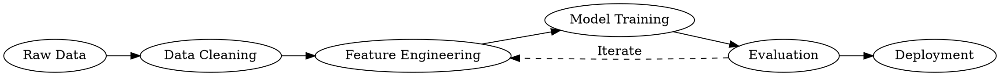

## Utility Tools for Data Scientists

While programming languages, libraries, and frameworks form the core of your data science toolkit, a handful of smaller utilities remove real friction from day-to-day work. This appendix is a catalogue rather than a curriculum: nothing in the main chapters depends on any of it, and you should adopt items from it when you notice a problem they solve, not because they're listed here.

### AI Coding Assistants

Large-language-model-based coding assistants are probably the single biggest productivity change in data science tooling since this book was first drafted. For readers without a CS background they're especially useful: they can scaffold boilerplate, explain unfamiliar code, translate between Python and R, suggest fixes for cryptic error messages, and draft regex patterns or SQL queries on request. The caveat is universal: they confidently produce wrong answers too, so treat suggestions as a fast draft to be reviewed, not an oracle.

A few options worth knowing. Pricing differs between them, so the cost note matters as much as the description:

- **[GitHub Copilot](https://github.com/features/copilot)**: In-editor completion and chat inside VS Code, JetBrains IDEs, Neovim, and the web. The most mature and widely used option. Has a genuine free tier with a monthly allowance of completions and chats, and is free outright for verified students, educators, and maintainers of popular open-source projects.
- **[Claude for VS Code](https://docs.claude.com/en/docs/claude-code/ide-integrations) and [Claude Code](https://www.claude.com/product/claude-code)**: Anthropic's CLI and IDE integrations. Claude Code runs in a terminal and can read, edit, and run code in a project with your supervision. Particularly good for multi-file refactors. Requires a paid Claude subscription or API credits — there is no free tier.
- **[Cursor](https://cursor.com/)**: A fork of VS Code with deep LLM integration throughout the editor. Popular with developers who want a single tool rather than an extension. Free hobby tier, paid beyond it.
- **[Aider](https://aider.chat/)**: An open-source terminal-based pair-programmer that uses git commits as its unit of work. A great fit if you already live in the terminal. The tool itself is free; you supply an API key and pay the model provider for usage.

For genuinely throwaway tasks, the web chat interfaces to [Claude](https://claude.ai/) and [ChatGPT](https://chatgpt.com/) are fine. For anything you'll actually check into a repository, prefer an IDE integration so the suggestions have full context of your code.

A few habits that make these tools more useful and less dangerous:

1. **Read the diff**. Never accept an edit without skimming what changed.
2. **Don't paste secrets**. Anything you put into a prompt may end up in provider logs. Strip API keys, connection strings, and personal data before sharing code.
3. **Ask for explanations alongside code**. "Write this function and explain why you chose this approach" is a much better prompt than "write this function", because you learn something and can spot mistakes faster.
4. **Run the code**. LLMs hallucinate function signatures, flag names, and library behaviours. Trust the interpreter over the chatbot.

### Text Editors and IDE Enhancements

[Editors and Version Control](ide_git.qmd) covers **Visual Studio Code** (VS Code) as the primary recommended editor for data science across Python, R, SQL, and notebooks. It's free, cross-platform, scriptable, and has the largest extension ecosystem of any editor. For most readers, VS Code plus the extensions listed in that chapter is the whole answer.

The editors below are lightweight alternatives for quick edits, very large files, or platform-specific situations.

#### Notepad++

Notepad++ is a free, open-source text editor for Windows, and a substantial step up from the built-in Notepad.

What earns it a place is column editing — hold Alt and drag to select a rectangle, then type into every selected line at once, which turns a tedious manual clean-up into one edit — and find-and-replace by *regular expression*, a compact notation for describing text shapes like "a date" or "any line ending in a comma". Both are things you'd otherwise write a script for.

**Installation:**

1. Download from [notepad-plus-plus.org](https://notepad-plus-plus.org/downloads/)
2. Run the installer and follow the prompts

**Useful shortcuts:**

- `Ctrl+H`: Find and replace
- `Alt+Shift+Arrow`: Column selection mode
- `Ctrl+D`: Duplicate current line
- `Ctrl+Shift+Up/Down`: Move current line up/down

Notepad++ is useful for quickly viewing and editing text files, CSV extracts, or configuration files without launching a full IDE. It is not a large-file tool: it has a hard limit around 2 GB and becomes sluggish well before that. For a genuinely large CSV, read a sample in pandas or query it in place with DuckDB rather than trying to open it.

### API Development and Testing Tools

Sooner or later you'll be handed an API and a key and asked to get data out of it. These tools let you send a request and look at what comes back before you write any code.

#### Postman

Postman is the most widely used tool for API development and testing, and the one whose interface most tutorials assume.

You build a request in a form, send it, and read the response formatted rather than as a wall of JSON. Requests save into collections you can re-run, with environment variables swapping a dev URL for a production one without editing each request.

**Installation:**

1. Download from [postman.com](https://www.postman.com/downloads/)
2. Create a free account to sync across devices

**Example workflow:**

1. Create a new request to a data API:

   ```
   GET https://api.example.com/data?limit=100
   ```

2. Add authentication (if required):

   ```
   Authorization: Bearer your_token_here
   ```

3. Send the request and analyse the JSON response
4. Save the request to a collection for future use

Postman earns its place when you're working with data APIs — financial markets, weather services, or an internal company endpoint — and want to poke at the response before writing any code against it.

One caveat worth knowing before you commit: Postman now requires an account and syncs your collections to its cloud by default. For work under a client NDA, or anywhere requests carry credentials you'd rather not upload, check what your organisation's policy says about that.

#### Bruno and Insomnia

Two alternatives, both a response to the same concern:

- **[Bruno](https://www.usebruno.com/)** stores collections as plain text files in a folder you choose, which means they live in Git alongside the code that calls the API and diff like any other source file. Offline by default, no account required. If the cloud-sync caveat above matters to you, this is the one to look at.
- **[Insomnia](https://insomnia.rest/)** is lighter than Postman with good GraphQL support. Note that since Kong's 2023 changes, using it without an account means working in Scratch Pad mode, which limits what you can save — check the current terms before assuming the free tier fits your workflow.

For occasional API work, any of the three is fine. The choice matters when collections need to be shared, version-controlled, or kept off someone else's servers.

### Database Management Tools

A graphical client is worth having for exploring a database you didn't design — browsing tables and relationships is much faster by clicking than by querying `information_schema`.

#### DBeaver

DBeaver is a universal database tool that works with almost any database system.

One application for PostgreSQL, MySQL, SQLite, Oracle and most things you'll be handed credentials to, which saves learning a different client per database. It'll draw the ER diagram of a schema you've never seen before, which is usually the fastest way to work out how an unfamiliar database fits together, and export a result set straight to CSV.

**Installation:**

1. Download from [dbeaver.io](https://dbeaver.io/download/)
2. Run the installer

**Example workflow:**

1. Connect to a database with connection parameters
2. Browse tables and view structure
3. Use the SQL editor to write a query:

   ```sql
   SELECT
       product_category,
       COUNT(*) as count,
       AVG(price) as avg_price
   FROM products
   GROUP BY product_category
   ORDER BY count DESC;
   ```

4. Export results to CSV for analysis in Python or R

DBeaver streamlines database interactions, allowing you to explore data structures, write queries, and export results without writing code to establish database connections.

#### pgAdmin

pgAdmin is a specialised tool for PostgreSQL databases.

DBeaver covers most PostgreSQL work. pgAdmin is worth having when you need the parts that are specific to Postgres and that a generic client doesn't expose: backup and restore, role and permission management, and the server activity view that shows you which query is holding a lock.

**Installation:**

1. Download from [pgadmin.org](https://www.pgadmin.org/download/)
2. Run the installer

### File Comparison

Comparing two versions of a dataset or a config file is common enough to want a tool for it. Git handles this for anything under version control; for everything else there is **WinMerge**, free and open source, on Windows.

It shows two files side by side with the differing lines highlighted, and does the same for two directories, which is the quicker way to answer "what changed between these two extracts".

**Installation:**

1. Download from [winmerge.org](https://winmerge.org/downloads/)
2. Run the installer

On macOS and Linux, `diff` is already installed and VS Code compares two open files from the Explorer (right-click → **Select for Compare**), which covers most of the same ground without another install.

### Terminal Enhancements

Once you're in a terminal every day, the defaults start to grate. These fix the worst of it.

#### Oh My Zsh

Oh My Zsh is a framework for managing your Zsh configuration, providing themes and plugins for the Z shell.

The two things you notice on day one are the prompt telling you which Git branch you're on and whether it's dirty, and tab completion that knows the flags a command takes rather than just the files in the directory. Neither is dramatic; both stop small mistakes.

**Installation (macOS or Linux):**

```bash
# Install Zsh first if needed
# Ubuntu/Debian:
# sudo apt install zsh
# macOS (usually pre-installed)

# Set Zsh as default shell
chsh -s $(which zsh)

# Install Oh My Zsh. It's good practice to review the installer script
# before executing anything you download from the internet:
curl -fsSL https://raw.githubusercontent.com/ohmyzsh/ohmyzsh/master/tools/install.sh -o install-ohmyzsh.sh
less install-ohmyzsh.sh   # read it, check for anything suspicious
sh install-ohmyzsh.sh
```

Many sites still show a one-liner `sh -c "$(curl ... install.sh)"`, which downloads and immediately executes code from a third-party server. The two-step version above takes five extra seconds and lets you actually see what's about to run on your machine.

**Useful plugins for data scientists:**

```bash
# Edit ~/.zshrc to activate plugins
plugins=(git python pip conda docker)
```

Only name plugins that exist — Oh My Zsh prints `plugin 'x' not found` in every new shell otherwise, and there is no `jupyter` plugin despite several tutorials listing one. The [plugins directory](https://github.com/ohmyzsh/ohmyzsh/tree/master/plugins) is the authoritative list.

Oh My Zsh makes the command line more user-friendly and efficient, which is valuable when working with data processing tools, running scripts, or managing environments.

#### Windows Terminal and PowerShell 7

On Windows, **Windows Terminal** (pre-installed on Windows 11 and free from the Microsoft Store on Windows 10) replaces the legacy `cmd.exe` window with tabs, split panes and keyboard shortcuts that behave the way you'd expect. Pair it with **PowerShell 7** (`winget install Microsoft.PowerShell`), which is cross-platform and much more pleasant to script than the built-in Windows PowerShell 5.1. If you want a Unix-like experience on Windows, use WSL (covered in [The Command Line](command_line.qmd)) from inside Windows Terminal, which handles both worlds side-by-side.

#### Modern Rust-based CLI replacements

A family of newer command-line tools, mostly written in Rust, have become the de-facto replacements for the standard Unix utilities. They're all faster than the originals and, more importantly for this book's audience, tend to have friendlier defaults and output. Every one is installable with Homebrew, apt, `winget`, `choco`, or `cargo`:

| Instead of | Use | What you get |
|---|---|---|
| `grep` | **[ripgrep](https://github.com/BurntSushi/ripgrep)** (`rg`) | Much faster recursive search; respects `.gitignore` by default |
| `find` | **[fd](https://github.com/sharkdp/fd)** | Saner syntax, colour output, skips `.git` and anything in your `.gitignore` |
| `cat` | **[bat](https://github.com/sharkdp/bat)** | Syntax highlighting and line numbers |
| `ls` | **[eza](https://github.com/eza-community/eza)** | Git status, icons, tree view |
| `cd` | **[zoxide](https://github.com/ajeetdsouza/zoxide)** | `z projectname` jumps to any directory you've visited |
| `htop` | **[btop](https://github.com/aristocratos/btop)** | Prettier resource monitor |
| Bash/Zsh prompt | **[starship](https://starship.rs/)** | Fast, configurable, works in any shell including PowerShell |

For Python and R tooling specifically, three newer tools are now standard enough to mention:

- **[uv](https://docs.astral.sh/uv/)**: a Python package manager and virtual-environment tool written in Rust, dramatically quicker than pip at resolving and installing. It's a drop-in replacement for `pip`, `pip-tools`, `virtualenv`, and `pyenv`. Create an environment with `uv venv`, install from a `requirements.txt` with `uv pip install -r requirements.txt`, and run project scripts with `uv run`.
- **[ruff](https://docs.astral.sh/ruff/)**: a Python linter and formatter, also from Astral, fast enough to run on every keystroke where the tools it replaces (flake8, isort, black) were not. Modern Python projects almost always use it.
- **[pixi](https://pixi.sh/)**: a project-based package manager built on the conda ecosystem. Think of it as "uv for conda": fast, lockfile-driven, cross-platform reproducible environments, especially useful for projects that mix Python with R, C++, CUDA, or system libraries.

None of these are required to follow this book, and the classic `pip`, `conda`, `grep` and `find` commands all still work. Install them when you get tired of waiting for the originals.

### Data Wrangling Tools

Two command-line tools for the jobs that don't quite justify opening an editor.

#### CSVKit

CSVKit is a suite of command-line tools for working with CSV files.

It gives you `csvstat` for a quick summary of every column, `csvcut` to pull out named columns, `csvgrep` to filter rows, `csvsort`, and `csvjoin` for joining two files on a key. Each is a CSV-aware version of a standard Unix tool, so they understand quoted fields and headers where `grep` and `cut` don't.

**Installation:**

```bash
pip install csvkit
```

**Example commands:**

```bash
# View basic statistics of a CSV file
csvstat data.csv

# Extract specific columns
csvcut -c 1,3,5 data.csv > extracted.csv

# Filter rows containing a pattern
csvgrep -c 2 -m "Pattern" data.csv > filtered.csv

# Sort by a column
csvsort -c 3 data.csv > sorted.csv
```

CSVKit earns its place for quick exploration directly from the command line — checking what's in a file, or pulling two columns out of it, without opening an editor and writing a script.

#### jq

jq is a lightweight command-line JSON processor that helps manipulate JSON data.

It filters, reshapes and does arithmetic on JSON from the command line, which is most useful when an API hands you a deeply nested response and you want to see its shape before writing any code against it.

**Installation:**

```bash
# macOS
brew install jq

# Ubuntu/Debian
sudo apt install jq

# Windows (with Chocolatey)
choco install jq
```

**Example commands:**

```bash
# Pretty-print JSON
cat data.json | jq '.'

# Extract specific fields
cat data.json | jq '.results[] | {name, value}'

# Filter based on a condition
cat data.json | jq '.results[] | select(.value > 100)'

# Calculate statistics
cat data.json | jq '[.results[].value] | {count: length, sum: add, average: add/length}'
```

Pair it with `curl` and you can explore an API's responses without leaving the terminal.

### Diagramming and Visualisation Tools

The Mermaid diagrams in [Data Visualisation](visualisation.qmd) cover most of what you'll need. Two tools are worth knowing for the cases they don't.

#### diagrams.net (formerly draw.io)

diagrams.net is a free, open-source online diagramming tool that works with various diagram types.

Free, runs in a browser, saves where you tell it, and covers flowcharts, ER diagrams and architecture sketches. Reach for it over Mermaid when you want control of the layout rather than a diagram generated from text.

**Access:**

1. Go to [app.diagrams.net](https://app.diagrams.net/) in your browser
2. Choose where to save your diagrams (local, Google Drive, etc.)

**Example data science use case:**
Creating a data flow diagram to document an ETL process — extract, transform, load, the standard name for a pipeline that pulls data from a source, reshapes it, and writes it somewhere queryable:

1. Select the flowchart template
2. Add data sources, transformation steps, and outputs
3. Connect components with arrows showing data flow
4. Add annotations explaining transformations
5. Export as PNG for inclusion in documentation

A pipeline diagram is usually the fastest way to explain to a stakeholder what happens to their data between the source system and the report.

#### Graphviz

Graphviz is a command-line tool for creating structured diagrams from text descriptions.

You describe the nodes and edges and Graphviz works out the layout, which is what makes it worth using for graphs generated from data — a dependency tree, a state machine, a network — where you don't know in advance how many nodes there will be. Python and R both have bindings.

**Installation:**

```bash
# macOS
brew install graphviz

# Ubuntu/Debian
sudo apt install graphviz

# Windows (with Chocolatey)
choco install graphviz
```

**Example DOT file (graph.dot):**


```dot
digraph DataPipeline {
  rankdir=LR;

  raw_data [label="Raw Data"];
  cleaning [label="Data Cleaning"];
  features [label="Feature Engineering"];
  modeling [label="Model Training"];
  evaluation [label="Evaluation"];
  deployment [label="Deployment"];

  raw_data -> cleaning;
  cleaning -> features;
  features -> modeling;
  modeling -> evaluation;
  evaluation -> deployment;
  evaluation -> features [label="Iterate", style="dashed"];
}
```

**Generate the diagram:**

```bash
dot -Tpng graph.dot -o pipeline.png
```

Graphviz is particularly useful for generating diagrams programmatically as part of automated documentation processes or for visualising complex relationships that would be tedious to draw manually.

### Screenshots

Screenshot utilities were once worth installing separately. They mostly aren't any more — every current OS ships one that annotates:

- **Windows**: Snipping Tool (`Win+Shift+S` for a region capture straight to the clipboard). Annotates, and records short screen videos.
- **macOS**: `Cmd+Shift+4` for a region, `Cmd+Shift+5` for the capture-and-record panel. Markup opens from the thumbnail that appears after a capture.
- **Linux**: varies by desktop — GNOME's Screenshot and KDE's Spectacle both cover region capture and annotation.

You'll still see older guides recommending Greenshot for this on Windows. It works, but its last stable release was in 2017 and the built-in tool now does the same job.

For anything beyond a static image — a bug you can only demonstrate by reproducing it — record a short clip instead. Screenshots of error messages are a common source of confusion in bug reports: paste the text.

### Note-Taking

#### Obsidian

Obsidian is a knowledge base and note-taking application that works on Markdown files.

Notes are plain Markdown files in a folder on your machine, which means they outlive the application, work with `ripgrep`, and can go in a Git repository. Links between notes go both ways, so opening a note shows you everything that referenced it.

**Installation:**

1. Download from [obsidian.md](https://obsidian.md/download)
2. Run the installer

**Example data science use case:**
Creating a personal knowledge base for your data science projects:

1. Create notes for each project with objectives and findings
2. Link to related techniques and concepts
3. Embed code snippets and results
4. Use tags to categorise by domain or technology
5. Visualise the connections in your knowledge with the graph view

Obsidian helps capture the thought process behind your data science work, creating a valuable reference for future projects.

### Finding Things

Searching across files is common enough in analytical work — where is this variable used, which script produced this column — that it's worth having a fast tool for it.

**`ripgrep` (`rg`)** is the answer on every platform. It's already listed in the command-line tools section above; this is just to say that it also replaces the category of dedicated desktop search applications you may have used on Windows. It respects `.gitignore` by default, so it won't waste time searching your `.venv` or your raw data.

```bash
# Every occurrence of a column name across a project
rg "customer_lifetime_value"

# Only in Python files, showing three lines of context
rg -t py -C 3 "def build_features"

# Files that mention it, without the matching lines
rg -l "POPIA"
```

VS Code's search panel (`Ctrl+Shift+F`) uses ripgrep underneath, so if you prefer a graphical interface you already have one with the same speed and the same `.gitignore` behaviour.

For finding *files* rather than text inside them, `fd` is the equivalent — also listed above.

## Conclusion

The tools in this appendix are optional by definition. Nothing in the main chapters depends on any of them, and adopting all of them at once would be a poor use of a week.

The productive approach is to add one when you notice friction. If you keep opening a CSV in Excel just to see what's in it, try `csvstat`. If you're testing an API by writing throwaway scripts, install Bruno. If you're taking notes on projects in a text file you can't search, try Obsidian.

Two of these are worth adopting sooner rather than later regardless of whether you've noticed the friction:

- **An AI coding assistant**, because the productivity difference is large and the learning curve is short.
- **`ripgrep`**, because searching a codebase is something you do many times a day once you have a tool fast enough to make it worth doing.

Everything else can wait until you want it.
